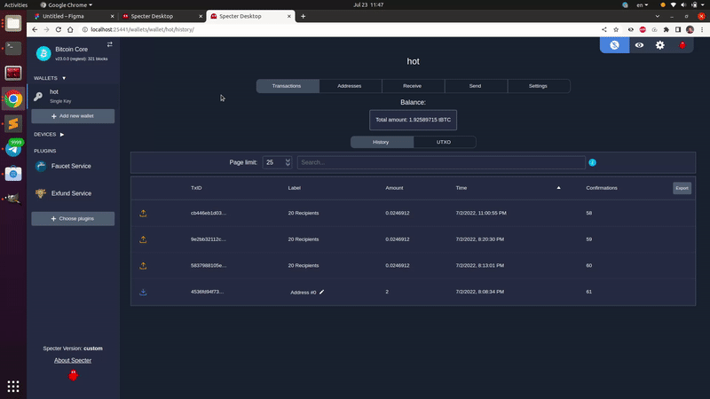

# Exfund

Specter extension to fund multiple addresses from a wallet. Parses CSV files with addresses, and optionally labels and amounts. Also supports setting the same amount for all addresses and liquid assets.

## Demo



## Install with pip

```sh
python3 -m pip install specterext-exfund
```

## Run in dev mode:

```sh
python3 -m cryptoadvance.specter server --config DevelopmentConfig --debug
```

## Example CSV:

```csv
Address,Label,Amount
bcrt1qe2lmnwnmu7avpr2htnvwsu0z8886dkh0gj0hms,Salary June,12345678
bcrt1qr7d9ektwguscl6mtgt406kesrjdxxtnt9xkvrn,Conference refund,8274300
bcrt1qr54ct3lmuytux2ut9vvmphxgsrwrduggnahqqe,,100000
bcrt1qnk6p4ker2zkxeez9dymjd3g6j6xctceqlnsk6e,VPN payment,43297
bcrt1qgp9dpv2fjszfe70d9c4jweadedrzlgc38lpyym,Specter donation,1000000
bcrt1qmvm8es2r4nq9qvpdm8f6dcvn6vfd45trxxak2v9azjr3x4670n0q2szdv8,Lightning channel with lnbits,100000
```