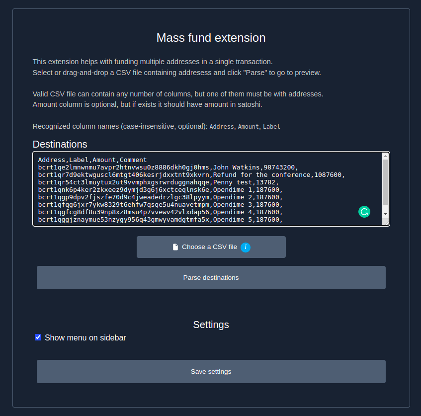
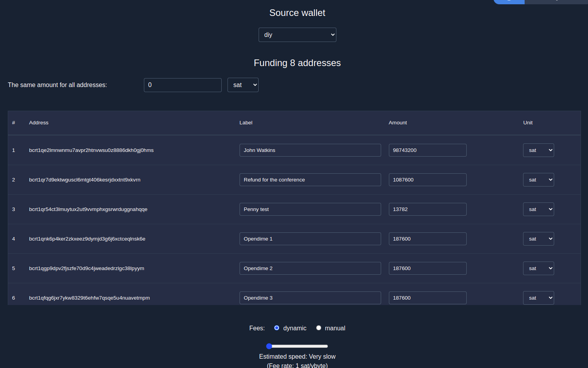

# Exfund

Specter extension to fund multiple addresses from a wallet. Parses CSV files with addresses, and optionally labels and amounts. Also supports setting the same amount for all addresses and liquid assets.

## Screenshots





## Install with pip

```sh
python3 -m pip install specterext-exfund
```

## Run in dev mode:

```sh
python3 -m cryptoadvance.specter server --config DevelopmentConfig --debug
```
